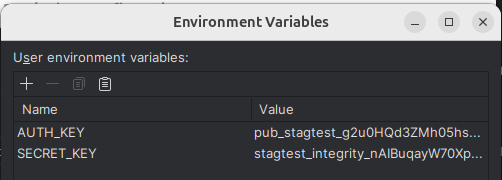

# CHALLENGE AUTOMATIZACIÓN WOMPI

---

## Herramientas implementadas:

* Serenity Rest
* Serenity BDD
* Serenity Rest
* Cucumber
* JUnit
* Lombok

### Patron de diseño:

* ScreenplayBDD

### Lenguaje de programación:

* Java 21

### Gestor de dependencias:

* Gradle

---

## Pre-Condiciones:

* Tener instalado el [JDK](https://www.oracle.com/co/java/technologies/javase/javase8-archive-downloads.html) de Java
  con una versión igual o superior a 1.8.
* Tener instalado y configurado [GRADLE](https://gradle.org/releases/).
* Clona el proyecto desde la rama principal **`main`** utilizando el siguiente comando:
    * `git clone https://github.com/dfmerchan2/challenge-wompi.git`

## Variables

* Configurar variables en el IDE
    * AUTH_KEY = pub_stagtest_g2u0HQd3ZMh05hsSgTS2lUV8t3s4mOt7
    * SECRET_KEY = stagtest_integrity_nAIBuqayW70XpUqJS4qf4STYiISd89Fp
      

---

## Integración Continua

En GitHub Actions, se ha implementado el archivo `gradle.yml` para llevar a cabo la compilación, ejecución de pruebas y
generar el informe de Serenity.
* Ejecucion: [GitActions](https://github.com/dfmerchan2/challenge-wompi/actions)

---

* ### Comandos Gradle

```
gradle build -x test                                              (Compila el proyecto, excluyendo la ejecución de pruebas.)
gradle test --tests *PaymentsRunner* =>                           (Ejecuta un Runner específico llamado)
gradle test --tests *MerchantsRunner* --tests *PaymentsRunner*    (Ejecuta varios Runners específicos)
gradle test aggregate                                             (Ejecuta toda la suite de pruebas en el proyecto y genera un informe de Serenity.)
gradle clean test --tests "co.com.wompi.runners.*" aggregate -i   (Ejecutar un paquete de Runners, limpia el proyecto, y genera un informe de Serenity, mostrando información detallada)
```

---

## Reporte Serenity

* Una vez completada la ejecución de las pruebas, dirígete a la ruta **"target/site/serenity"** y abre el archivo *
  *index.html** en tu navegador para visualizar el informe generado por Serenity.

---

## Autor 🤖

* Diego Fernando Merchan Jimenez
    